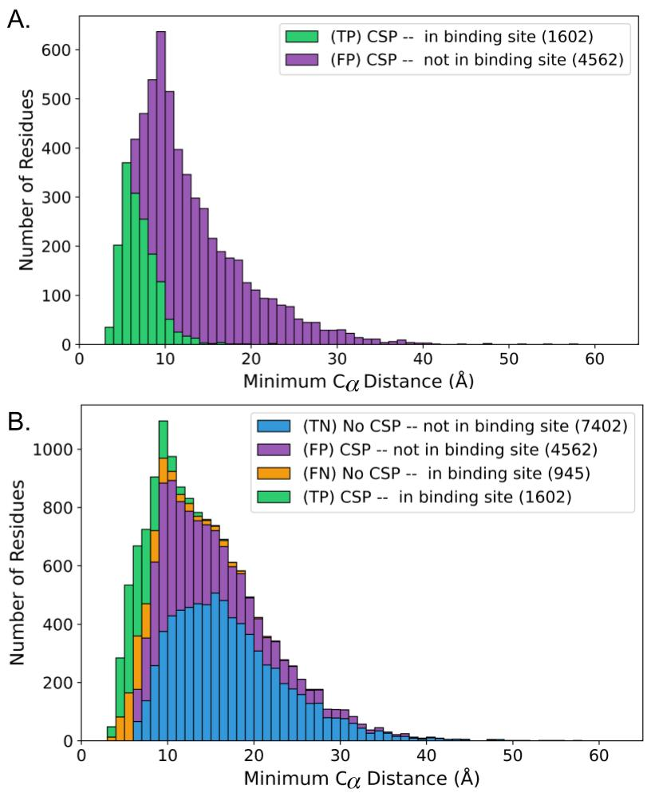
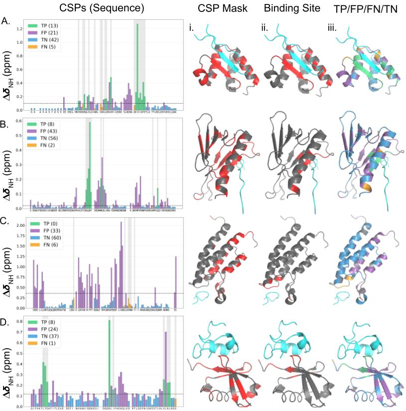

# CSPdb — Chemical shift perturbations and binding-site classification

**CSPdb** is a curated collection of protein-polypeptide systems for which paired apo and holo 15N-HSQC-derived assignments are available in the BMRB, together with holo coordinates in the PDB. This repository hosts a Python pipeline used to align sequences, reference and compare chemical shifts, define significant CSPs and binding-site residues, and document the prevalence of significant CSPs distant from the binding site through a [binary classification scheme](#binary-classification).

## Citation and data

- **Publication:** [Link TBD — add when available](https://example.com)
- **Dataset (Zenodo):** [DOI TBD — add when available](https://doi.org/10.5281/zenodo.TBD)
- **GitHub Release (Zenodo):** [DOI TBD — add when available](https://doi.org/10.5281/zenodo.TBD)

---

## Figure 1



*Fig. 1. Stacked histograms summarizing the confusion matrix across the CSPdb. In both panels, the x-axis shows the minimum interchain Cα–Cα distance for residues in the receptor chain. (A) Significant CSPs. Green bars: residues within the binding site (TPs); purple bars: residues outside the binding site (FPs). Overall, 74% of significant CSPs occur outside the binding site. (B) All residues. In addition to the significant CSPs shown in (A), residues with no (significant) CSPs are included: blue bars: residues outside the binding site (TNs); orange bars: residues within the binding site (FNs). Calculating CSPs using Cα shifts yields similar results in complementary analyses in this repository; additional summaries using minimum interchain N–N distances and minimum interatomic distances are produced by the same analysis framework. CSP and binding-site residues are defined in **Methods** below. Colors used throughout correspond to the confusion matrix classification: TP (green), FP (purple), TN (blue), and FN (orange); aggregate counts per quadrant are in parentheses.*

---

## Figure 2



*Fig. 2. Representative case studies. (Left) Calculated CSPs for receptor residues along the sequence, bars colored by confusion matrix classification (see Fig. 1 for color key). Dashed horizontal lines indicate the significance threshold (**Methods**), and gray shading highlights binding-site residues. Molecular graphics panels (left to right) show PyMOL renderings of receptor structures colored by (i) the mask of significant CSPs, with significant CSPs in red and residues without CSP measurements or insignificant CSPs shown in gray, (ii) the binding-site residues (**Methods**) in red and residues outside of the binding site in gray, and (iii) the confusion matrix classification projected onto the structure; ligands are colored cyan.*

- **(A)** holo PDB 7JQ8; apo BMRB 30782; holo BMRB 30786.  
- **(B)** holo PDB 2M14; apo BMRB 6225; holo BMRB 18842.  
- **(C)** holo PDB 2RS9; apo BMRB 19125; holo BMRB 11463.  
- **(D)** holo PDB 2KWV; apo BMRB 17769; holo BMRB 16885.

---

## Methods

### Data collection

Targets were collected by manual scraping of the PDB, using advanced search filters applied consistently for CSPdb curation (exact filter settings are recorded alongside the scraping workflow in this repository). Targets were included when a receptor chain with identical apo/holo sequences was deposited in the BMRB, and there was a working link between the holo PDB deposition and the holo BMRB deposition. As additional criteria, the experimental conditions used for apo and holo NMR assignments of the receptor had to be approximately the same: pH within ±0.5 units and temperature within ±5 °C. Differences in conditions can cause systematic chemical shift changes not specific to ligand binding. An additional 1211 targets with experimental conditions outside these thresholds were scraped from the PDB; summary statistics for that subset are included in this repository.

### Calculating CSPs

CSPs are calculated by comparing chemical shifts between bound and free forms of the receptor. In each case, apo and holo chemical shifts were referenced by applying offsets to the holo shifts. The optimal offset was determined by a grid search over candidate 1H and 15N holo shifts, selecting the pair that **maximizes the count of aligned residues** whose offset-corrected amide CSP (same `sqrt(0.5 * (Δδ_H^2 + (0.14 * Δδ_N)^2))` form) is **below 0.05 ppm**; this cutoff is `Referencing.grid_cutoff` in `scripts/config.py`.

Example grid-search heat maps for optimal N/H holo shift offsets can be written per target (e.g. the ET–TP system, PDB ID 7JQ8) as `offset_grid_*.png` under `outputs/<holo_pdb>/`. CSPs follow the weighted amide form used in prior work (citations in the publication). Offsets for processed targets are cached alongside those outputs.

The amide CSP implemented in this codebase is:

$$\text{CSP} = \sqrt{\tfrac{1}{2}\left(\Delta\delta_H^2 + (0.14\,\Delta\delta_N)^2\right)}$$

### Defining significant CSPs

Significance thresholds follow the spirit of established protocols (citation in the publication). Thresholds were determined as follows:

1. Compute the list of CSP values for aligned residues (see standard CSP literature for the treatment of missing data and alignment).
2. Iteratively remove outlier CSPs with a Z-score greater than 3 (\(\sigma > 3\)) until a stable subset with no outliers remains.
3. Define the final cutoff as the **mean** CSP of that outlier-free subset.

A histogram summarizing CSP thresholds across the dataset can be regenerated with the figure-generation scripts; the average significance cutoff across the CSPdb was **0.0834 ppm**. This is somewhat higher than typical reported reproducibility of chemical shifts (~0.020 ppm), likely reflecting small residual differences between apo and holo NMR studies. Lower thresholds would flag more long-range CSPs; the chosen procedure is therefore a comparatively conservative estimate.

### Defining the binding site

A residue is considered part of the binding site if it satisfies **any** of:

- H-bonds to the ligand (Baker-Hubbard criteria: theta > 120°, H···A < 2.5 Å).
- Charge complementarity with the ligand (opposite charged groups within 4.5 Å).
- π contacts (NH-to-aromatic within 6 Å).
- SASA occlusion: non-negligible change in solvent-accessible surface area (Shrake–Rupley) for backbone N and H atoms on the medoid holo model with versus without ligand atoms.
- Interchain Cα-Cα distance < 6.0 Å.
- Any interchain atom-atom distance < 2.0 Å.

### Binary classification

Significant CSPs and binding-site membership define a 2×2 confusion matrix; **F1** and **MCC** are computed from it. Summary comparisons of F1 and MCC across targets can be produced with the bundled analysis scripts. Colors match Fig. 1–2: **TP** green, **FP** purple, **TN** blue, **FN** orange.

|  | Residue in binding site | Residue not in binding site |
|--|-------------------------|------------------------------|
| **Significant CSP** | 🟩 True Positive (TP) | 🟪 False Positive (FP) |
| **No significant CSP** | 🟧 False Negative (FN) | 🟦 True Negative (TN) |

---

## Environment setup

### pip

From the repository root (preferably in a virtual environment):

```bash
pip install -r requirements.txt
```

### Conda / Mamba

```bash
conda env create -f environment.yml
conda activate csp_ubq
```

---

## Running the pipeline

Process all rows in the input CSV (downloads BMRB/PDB data as needed, writes per-target outputs, and refreshes `outputs/confusion_matrix_per_system.csv` at the end of the run):

```bash
python scripts/pipeline.py --input data/CSP_UBQ.csv --out outputs
```

Run one selected target by holo PDB ID:

```bash
python scripts/pipeline.py --input data/CSP_UBQ.csv --holo-pdb 1cf4 --out outputs
```

Run multiple selected holo targets by using a filtered input CSV (with only those rows), then run without filter flags:

```bash
python scripts/pipeline.py --input data/CSP_UBQ_selected_holo.csv --out outputs
```

By default, detailed runtime output is written to per-target logs in `outputs/<holo_pdb>/logs/*.txt` (or `outputs/<holo_pdb>_<n>/logs/*.txt` for duplicate entries), and stdout is kept concise with step progress plus warnings/errors.

**Input CSV:** column definitions and optional flags (`--ids`, `--holo-pdb`, `--workers`, `--no-case-study`, metadata annotation, verbose logging) are documented in [docs/pipeline_reference.md](docs/pipeline_reference.md).

## Repository layout (abbreviated)

```
CSP_UBQ/
├── scripts/           # Python package and CLIs
├── docs/              # Project documentation
├── CS_Lists/          # BMRB cache
├── PDB_FILES/         # PDB cache
├── outputs/           # Pipeline outputs
├── figures/           # Generated or committed figures
├── data/              # Curated input CSV tables (CSP_UBQ.csv, targets_*.csv, etc.)
├── requirements.txt
├── environment.yml
└── README.md
```

## Further documentation

- **[Pipeline CLI reference](docs/pipeline_reference.md)** — complete command options, execution modes, output layout, and troubleshooting for `scripts/pipeline.py`.
- **[Supplement generation wrapper](docs/supplement_generation.md)** — how to run `scripts/create_all_supplement_figures_and_tables.py` and its prerequisites/options.
- **[Offset analysis script usage and outputs](docs/offset_analysis.md)** — how to run `scripts/analyze_offsets.py` and interpret its generated figures/CSV.
- **[Target-level analysis script usage and outputs](docs/README_analyze_targets.md)** — how to run `scripts/analyze_targets.py`, target selection modes, and summary artifacts.
